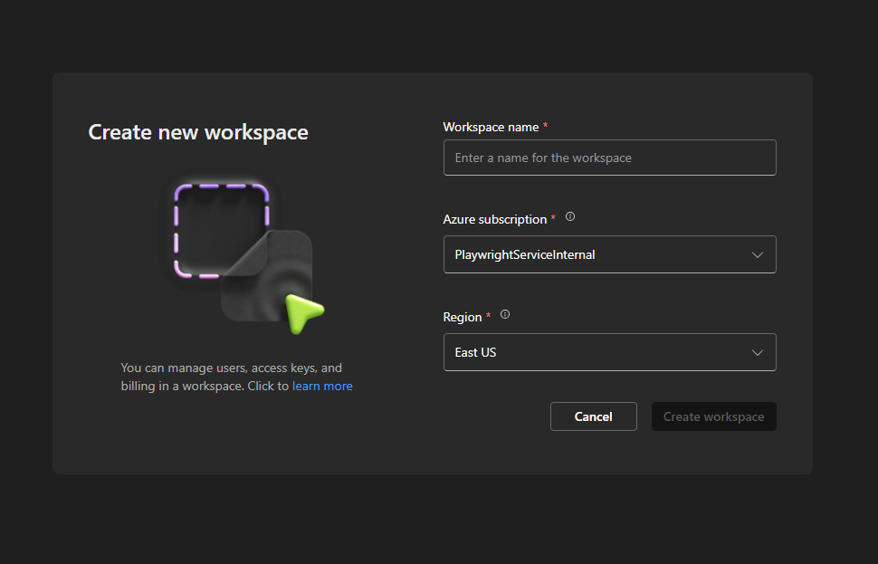
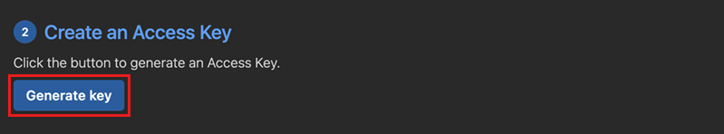
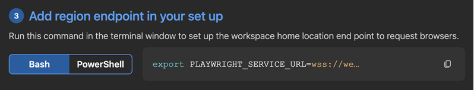

# Microsoft Playwright Testing private preview

Microsoft Playwright Testing service can speed up [Playwright](https://playwright.dev) test execution by increasing parallelism at cloud scale. The service is kept up-to-date with every new Playwright release, ensuring that you can run Playwright tests on a wide range of OS-browser combinations.

https://github.com/microsoft/playwright-testing-service/assets/12104064/23d626d3-c4f9-4dbe-a4b1-c4736b703b49

# How to start

> [!NOTE]
> We're still building the service and we understand that the process might still be a bit rough around the edges, or that some of the steps may be unfamiliar. Feel free to [reach out to us](https://aka.ms/mpt/feedback) if you encounter any challenges or have any questions.

## Confirm access to the private preview

While we're in private preview, you'll need to temporarily follow a few one-off steps in this guide: [Enable your Azure subscription for Microsoft Playwright Testing](./docs/onboard-subscription.md)

## Create a Workspace

1. Sign in to the [Playwright portal](https://aka.ms/mpt/portal) using your Azure account credentials. You may want to bookmark the website.

1. Create the Workspace.

    

    |Field  |Description  |
    |---------|---------|
    |**Workspace Name** | A unique name to identify your workspace.<BR>The name can't contain special characters or whitespace. |
    |**Azure Subscription** | Select an Azure subscription. If you don't see anything in the drop-down, you need to [onboard an Azure subscription to the private preview](./docs/onboard-subscription.md). |
    |**Region** | This is where test run data will be stored for your workspace. |

  > [!NOTE]
  > If you don't see this screen, select an existing workspace and go to the next section.

## Generate Access Key

1. In the [Playwright portal](https://aka.ms/mpt/portal), select **Generate key** to create the access key.

    

1. Copy the access key.

## Obtain region endpoint

> [!NOTE]
> This is a temporary step during the private preview.

1. In the [Playwright portal](https://aka.ms/mpt/portal), copy the command under **Add region endpoint in your set up**.

    

    The endpoint URL corresponds to the workspace region. You might see a different endpoint URL in the Playwright portal, depending on the region you selected when creating the workspace.

## Set up environment

Ensure that the `PLAYWRIGHT_SERVICE_ACCESS_KEY` and `PLAYWRIGHT_SERVICE_URL` that you obtained in previous steps are available in your environment.

We recommend using `dotenv` module to manage your environment. With `dotenv` you'll be using the `.env` file to define your environment variables.

> [!IMPORTANT]
> Don't forget to add `.env` file to your `.gitignore` file in order to not leak your secrets.

```sh
npm i --save-dev dotenv
```

`.env` file
```
PLAYWRIGHT_SERVICE_ACCESS_KEY=eyJh...
PLAYWRIGHT_SERVICE_URL=wss://westus3.api.playwright-int.io/api/authorize/connectSession
```

## Add service configuration

Add the service configuration to your project in the same location as your existing Playwright config file. Use [playwright.service.config.ts](https://aka.ms/mpt/service-config) as a starting point:

```js
// playwright.service.config.ts

import { defineConfig } from '@playwright/test';
import config from './playwright.config';
import dotenv from 'dotenv';

dotenv.config();

// Name the test run if it's not named yet.
process.env.PLAYWRIGHT_SERVICE_RUN_ID = process.env.PLAYWRIGHT_SERVICE_RUN_ID || new Date().toISOString();

export default defineConfig(config, {
    // Define more generous timeout for the service operation if necessary.
    // timeout: 60000,
    // expect: {
    //   timeout: 10000,
    // },
    use: {
    connectOptions: {
      // Specify the service endpoint.
      wsEndpoint: `${process.env.PLAYWRIGHT_SERVICE_URL}?cap=${JSON.stringify({
        os: process.env.PLAYWRIGHT_SERVICE_OS || 'linux',
        runId: process.env.PLAYWRIGHT_SERVICE_RUN_ID
      })}`,
      timeout: 30000,
      headers: {
        'x-mpt-access-key': process.env.PLAYWRIGHT_SERVICE_ACCESS_KEY!
      },
      // Allow service to access the localhost.
      exposeNetwork: '<loopback>'
    }
  }
});
```

The service configuration serves to:
- Direct and authenticate Playwright to the Microsoft Playwright Testing service.
- Override timeouts for service operations, if needed.

> [!NOTE]
> Make sure your project uses @playwright/test version 1.37 or above.

## Run the tests

Run Playwright tests against browsers managed by the service using the configuration you created above.

```sh
npx playwright test --config=playwright.service.config.ts --workers=20
```

## Next steps

- Experiment with different levels of parallelism. Learn more about how [parallelism](./docs/concept-understanding-parallelism.md) works with Playwright.

- Run tests in a [CI/CD pipeline.](./docs/configure-tests-with-ci-cd-pipeline.md)

- Learn how to [manage access](./docs/how-to-assign-roles.md) to the created workspace.

- Explore [troubleshooting guide](./docs/troubleshooting.md) and [known issues](./docs/known-issues.md).

## Contributing

This project welcomes contributions and suggestions. Most contributions require you to agree to a
Contributor License Agreement (CLA) declaring that you have the right to, and actually do, grant us
the rights to use your contribution. For details, visit https://cla.opensource.microsoft.com.

When you submit a pull request, a CLA bot will automatically determine whether you need to provide
a CLA and decorate the PR appropriately (e.g., status check, comment). Simply follow the instructions
provided by the bot. You will only need to do this once across all repos using our CLA.

This project has adopted the [Microsoft Open Source Code of Conduct](https://opensource.microsoft.com/codeofconduct/).
For more information see the [Code of Conduct FAQ](https://opensource.microsoft.com/codeofconduct/faq/) or
contact [opencode@microsoft.com](mailto:opencode@microsoft.com) with any additional questions or comments.

## Trademarks

This project may contain trademarks or logos for projects, products, or services. Authorized use of Microsoft
trademarks or logos is subject to and must follow
[Microsoft's Trademark & Brand Guidelines](https://www.microsoft.com/en-us/legal/intellectualproperty/trademarks/usage/general).
Use of Microsoft trademarks or logos in modified versions of this project must not cause confusion or imply Microsoft sponsorship.
Any use of third-party trademarks or logos is subject to those third-party's policies.
