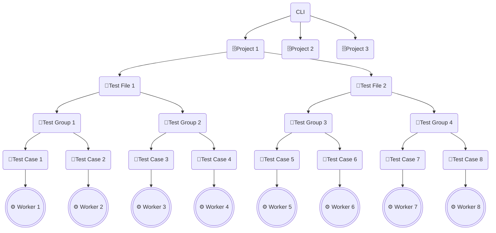

# Understanding parallelism in Playwright Service

With the Playwright Service you can speed up test execution by increasing parallelism at cloud-scale. This article explains the different levels to configure parallelism for your tests.

## Worker processes

All tests run in worker processes. These processes are OS processes, running independently, in parallel, orchestrated by the Playwright test runner. All workers have identical environments and each starts its own browser. The more worker processes that are available, the faster your tests will run.

When we run tests locally, we're limited to the number of CPU cores on our machine (as a rule of thumb, each browser instance requires 1 CPU core). By default, Playwright Test will limit the number of workers to one half of the number of CPU cores.

When we use the service, we can increase the number of workers at cloud-scale through simple configuration. In this setup, the worker processes continue to run locally but the browser instances -- which are resource-intensive -- now run in the cloud. The configuration can be set in our [global config file](https://playwright.dev/docs/test-configuration), or passed as an argument with the CLI:

```bash
npm playwright test --workers=30
```

## Parallelism hierarchy

Let's walk through the hierarchy of how parallelism is allocated. Starting at the top, each [project](https://playwright.dev/docs/api/class-testproject) configuration runs in parallel. An example project could be Chromium + Linux.

Next we have each test file, also referred to as a "file suite". Each file is run in parallel by default.

Within each test file, we have [test groups](https://playwright.dev/docs/test-annotations#group-tests) (optional) and test cases. Test groups help us organize our test cases and can be [configured to run in parallel](https://playwright.dev/docs/api/class-test#test-describe-parallel):

```typescript
test.describe.parallel('group', () => {
  test('runs in parallel 1', async ({ page }) => {});
  test('runs in parallel 2', async ({ page }) => {});
});
```

By default, test cases in a single file will run in order (serial). If you want to run test cases in parallel, you can use `test.describe.configure([options])`.

```typescript
test.describe.configure({ mode: 'parallel' });

test('runs in parallel 1', async ({ page }) => { /* ... */ });
test('runs in parallel 2', async ({ page }) => { /* ... */ });
```

## Example

The diagram below shows an example with 3 projects, 2 test files, 4 test groups, and 8 test cases. Project 1 results in 8 workers that run in parallel. Assuming that Project 2 and Project 3 run the same test files as Project 1, the maximum workers that can run in parallel for this example is 24 workers.



## Next steps

- For more information about configuring workers and test order in Playwright, see [Playwright OSS Parallelism and Sharding](https://playwright.dev/docs/test-parallel).

- [Integrate Playwright Service in a CI/CD pipeline.](./configure-tests-with-ci-cd-pipeline.md)