# Understanding parallelism in Microsoft Playwright Testing

With Microsoft Playwright Testing you can speed up test execution by increasing parallelism at cloud-scale. This article explains the different levels to configure parallelism for your tests. Lastly, we also describe current limits and expected service behavior when those limits are exceeded.

## Worker processes

All tests run in worker processes. These processes are OS processes, running independently, in parallel, orchestrated by the Playwright test runner. All workers have identical environments and each starts its own browser. Generally, increasing the number of parallel workers can reduce the time it takes to complete the full test suite - but there are limits.  

When we run tests locally, we're limited to the number of CPU cores on our machine (as a rule of thumb, each browser instance requires 1 CPU core). By default, Playwright Test will limit the number of workers to one half of the number of CPU cores. Beyond a certain point, adding more browser instances can lead to resource contention, slowing down each worker and introducing test flakiness.

When we use the service, we can increase the number of workers at cloud-scale through simple configuration. In this setup, the worker processes continue to run locally but the browser instances -- which are resource-intensive -- now run in the cloud. The configuration can be set in our [global config file](https://playwright.dev/docs/test-configuration), or passed as an argument with the CLI:

```bash
npx playwright test --workers=30
```

## Parallelism hierarchy

Let's walk through the hierarchy of how parallelism is allocated. Starting at the top, each [project](https://playwright.dev/docs/api/class-testproject) configuration runs in parallel. An example project could be Chromium + Linux.

Next we have each test file, also referred to as a "file suite". Each file is run in parallel by default.

Within each test file, we have [test groups](https://playwright.dev/docs/test-annotations#group-tests) (optional) and test cases. Test groups help us organize our test cases and can be [configured to run in parallel](https://playwright.dev/docs/api/class-test#test-describe-parallel):

```typescript
test.describe.parallel('group', () => {
  test('runs in parallel 1', async ({ page }) => {});
  test('runs in parallel 2', async ({ page }) => {});
});
```

By default, test cases in a single file will run in order (serial). If you want to run test cases in parallel, you can use `test.describe.configure([options])`.

```typescript
test.describe.configure({ mode: 'parallel' });

test('runs in parallel 1', async ({ page }) => { /* ... */ });
test('runs in parallel 2', async ({ page }) => { /* ... */ });
```

## Example

The diagram below shows an example with 3 projects, 2 test files, 4 test groups, and 8 test cases. Project 1 results in 8 workers that run in parallel. Assuming that Project 2 and Project 3 run the same test files as Project 1, the maximum workers that can run in parallel for this example is 24 workers.

```mermaid
graph TD
    A(CLI) --> B("🗄️Project 1")
    B --> E("📜Test File 1")
    B --> F("📜Test File 2")
    F --> W("📁Test Group 3")
    W --> X("🧪Test Case 5")
    X --> Y((("⚙️ Worker 5")))
    W --> Z("🧪Test Case 6")
    Z --> a((("⚙️ Worker 6")))
    F --> b("📁Test Group 4")
    b --> c("🧪Test Case 7")
    c --> d((("⚙️ Worker 7")))
    b --> e("🧪Test Case 8")
    e --> f((("⚙️ Worker 8")))
    E --> K("📁Test Group 1")
    K --> O("🧪Test Case 1")
    O --> S((("⚙️ Worker 1")))
    K --> P("🧪Test Case 2")
    P --> T((("⚙️ Worker 2")))
    E --> L("📁Test Group 2")
    L --> Q("🧪Test Case 3")
    Q --> U((("⚙️ Worker 3")))
    L --> R("🧪Test Case 4")
    R --> V((("⚙️ Worker 4")))
    A(CLI) --> C("🗄️Project 2")
    A(CLI) --> D("🗄️Project 3")
```



## Service limits
Microsoft Playwright Testing currently allows for up to 50 parallel workers per workspace. This limit is applicable to all active tests within a workspace. For example, multiple CI pipelines may concurrently initiate browser requests to Microsoft Playwright Testing. If the demand for parallel workers exceeds the 50-worker limit, any excess connection requests will be placed in a queue. Subsequently, one of two events will happen:

1. When a browser becomes available within the workspace, a queued request will be allocated a browser. The corresponding worker's tests will then begin executing.

1. If a queued request cannot be fulfilled before a specified timeout, a test timeout error will be generated and the request will be removed from the queue. The timeout duration can be adjusted via [Playwright test timeout properties](https://playwright.dev/docs/test-timeouts) in the Playwright configuration. (Note that server timeout may also occur, but this is not user-customizable.)

Please note that the service will return an HTTP status code of 429 (Too Many Requests) if it receives an excessive number of requests.

> [!NOTE]
> We continuously monitor service operations and make adjustments as needed. If you find that your test execution scenarios are being disrupted without good reason, or if the service is not meeting your expectations, please [share your feedback](https://aka.ms/mpt/feedback) with us.


## Next steps

- For more information about configuring workers and test order in Playwright, see [Playwright OSS Parallelism and Sharding](https://playwright.dev/docs/test-parallel).

- [Integrate Microsoft Playwright Testing in a CI/CD pipeline.](./configure-tests-with-ci-cd-pipeline.md)