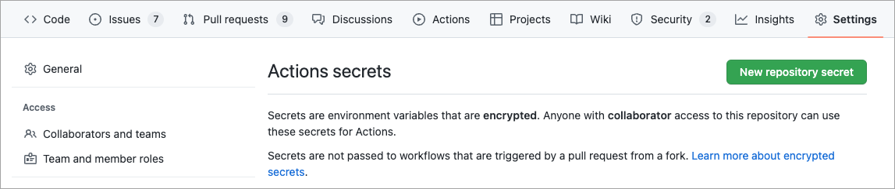
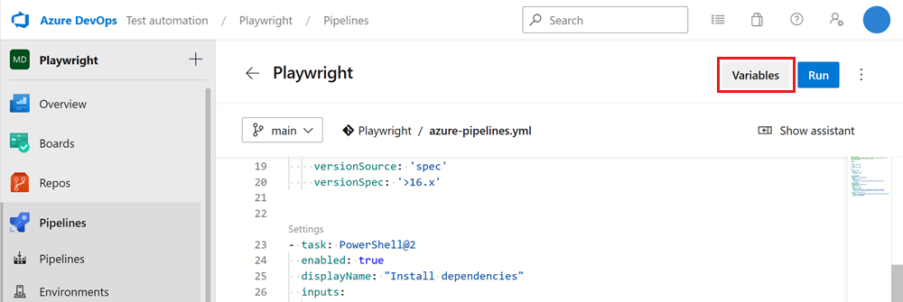

# CI/CD pipelines

This article guides you on how to run Playwright tests with Microsoft Playwright Testing in a [GitHub Actions](#github-actions) or [Azure Pipelines](#azure-pipelines) workflow. Similar steps will work for other CI platforms.

## GitHub Actions

To run Playwright tests with Microsoft Playwright Testing in a GitHub Actions workflow, perform the following steps:

1. Set up a Microsoft Playwright Testing access token in your GitHub repository:
        
    * Navigate to the GitHub repository where you want to integrate Microsoft Playwright Testing. Go to **Settings** -> **Secrets** -> **Actions**, and click **New Repository secret**. 

    * Create a secret named `PLAYWRIGHT_SERVICE_ACCESS_KEY` and paste the access token in the **Value** field.

        

1. Similarly, create a `PLAYWRIGHT_SERVICE_URL` secret for your workspace's region endpoint. To learn how to obtain your workspace's region endpoint, refer to the [Add region endpoint in your setup](./quickstart.md#add-region-endpoint-in-your-set-up) step in the Quickstart.

1. Add these steps to your GitHub Actions workflow. Learn more about GitHub workflows [here](https://docs.github.com/en/actions/using-workflows/using-starter-workflows#using-starter-workflows)
.

    ```yaml
    ...
    - name: Run Playwright tests
      env:
        PLAYWRIGHT_SERVICE_ACCESS_KEY: ${{ secrets.PLAYWRIGHT_SERVICE_ACCESS_KEY }}
        PLAYWRIGHT_SERVICE_URL: ${{ secrets.PLAYWRIGHT_SERVICE_URL }}
        PLAYWRIGHT_SERVICE_RUN_ID: ${{ github.run_id }}-${{ github.run_attempt }}-${{ github.sha }}
      run: npx playwright test -c playwright.service.config.ts --workers=20
    ```

    This will configure your tests to run on Microsoft Playwright Testing.

## Azure Pipelines

To run Playwright tests with Microsoft Playwright Testing in an Azure Pipelines workflow, perform the following steps:

1. Make sure your project is properly configured to use Microsoft Playwright Testing. The [Quickstart](./quickstart.md) covers this with step-by-step instructions.

1. Set up a Microsoft Playwright Testing access token in your Azure Pipelines workflow:

    * If you haven't already, generate an access token from the [Playwright portal](https://aka.ms/mpt/portal). This is the same step as [Create an Access Key](./quickstart.md#create-an-access-key) in the Quickstart.

    * Navigate to the Azure pipeline where you want to integrate Microsoft Playwright Testing. Go to **Edit** > **Variables**.

        

    * Select **+** to create a new variable, named `PLAYWRIGHT_SERVICE_ACCESS_KEY` and paste the access token in the **Value** field. Make sure to select **Keep this value secret**.

1. Similarly, create a `PLAYWRIGHT_SERVICE_URL` secret variable for your workspace's region endpoint. To learn how to obtain your workspace's region endpoint, refer to the [Add region endpoint in your setup](./quickstart.md#add-region-endpoint-in-your-set-up) step in the Quickstart.

1. Add these steps to your Azure Pipelines workflow. Learn more about [Azure Pipelines](https://learn.microsoft.com/en-us/azure/devops/pipelines/create-first-pipeline).

    ```yaml
    ...
    - task: PowerShell@2
      enabled: true
      displayName: "Run Playwright tests"
      env:
        PLAYWRIGHT_SERVICE_ACCESS_KEY: $(PLAYWRIGHT_SERVICE_ACCESS_KEY)
        PLAYWRIGHT_SERVICE_URL: $(PLAYWRIGHT_SERVICE_URL)
        PLAYWRIGHT_SERVICE_RUN_ID: $(Build.BuildId)-$(Build.Attempt)-$(Build.SourceVersion)
      inputs:
        targetType: 'inline'
        script: 'npx playwright test -c playwright.service.config.ts --workers=20'
    ```

    This will configure your tests to run on Microsoft Playwright Testing.
