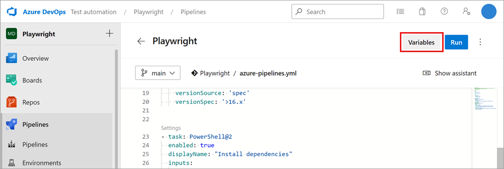

# Configure Microsoft Playwright Testing in a CI/CD pipeline

This article guides you on how to run Playwright tests with Microsoft Playwright Testing in a [GitHub Actions](#github-actions) or [Azure Pipelines](#azure-pipelines) workflow. Similar steps will work for other CI platforms.

## GitHub Actions

To run Playwright tests with Microsoft Playwright Testing in a GitHub Actions workflow, perform the following steps:

1. Set up a Microsoft Playwright Testing access key in your GitHub repository:

    * If you haven't already, generate an access key from the [Playwright portal](https://17157345.playwright-int.io/). This is the same step as *Create an Access Key* in the [Quickstart](./quickstart.md#L28).
        
    * Navigate to the GitHub repository where you want to integrate Microsoft Playwright Testing. Go to **Settings** -> **Secrets** -> **Actions**, and click **New Repository secret**. 
    
    * Create a secret named `PLAYWRIGHT_SERVICE_ACCESS_KEY` and paste the access key in the Value field.

        

1. Add these steps to your GitHub Actions workflow (learn more about GitHub workflows [here](https://docs.github.com/en/actions/using-workflows/using-starter-workflows#using-starter-workflows)
).

    ```yaml
    - name: Install dependencies
      working-directory: path/to/playwright/folder # update accordingly
      run: npm ci
    - name: Run Playwright tests
      working-directory: path/to/playwright/folder # update accordingly
      env:
        # Access key for Microsoft Playwright Testing
        PLAYWRIGHT_SERVICE_ACCESS_KEY: ${{secrets.PLAYWRIGHT_SERVICE_ACCESS_KEY}}
      run: npx playwright test -c playwright.service.config.ts --workers=20
    ```
    
    This will configure your tests to run on Microsoft Playwright Testing on every trigger of the workflow. The following sample provides a complete workflow to run tests with Microsoft Playwright Testing in GitHub Actions: [get-started.yml](../samples/get-started/.github/get-started.yml)

## Azure Pipelines

To run Playwright tests with Microsoft Playwright Testing in an Azure Pipelines workflow, perform the following steps:

1. Set up a Microsoft Playwright Testing access key in your Azure Pipelines workflow:

    * If you haven't already, generate an access key from the [Playwright portal](https://17157345.playwright-int.io/). This is the same step as *Create an Access Key* in the [Quickstart](./quickstart.md#L28).

    * Navigate to the Azure pipeline where you want to integrate Microsoft Playwright Testing. Go to **Edit** > **Variables**.

        

    * Select **+** to create a new variable, named `PLAYWRIGHT_SERVICE_ACCESS_KEY` and paste the access key in the Value field. Make sure to select **Keep this value secret**.

1. Add these steps to your Azure Pipelines workflow (learn more about [Azure Pipelines](https://learn.microsoft.com/en-us/azure/devops/pipelines/create-first-pipeline)).

    ```yaml
    - task: PowerShell@2
      enabled: true
      displayName: "Install dependencies"
      inputs:
        targetType: 'inline'
        script: 'npm ci'
        workingDirectory: path/to/playwright/folder # update accordingly

    - task: PowerShell@2
      enabled: true
      displayName: "Run Playwright tests"
      env:
        PLAYWRIGHT_SERVICE_ACCESS_KEY: $(PLAYWRIGHT_SERVICE_ACCESS_KEY)
      inputs:
        targetType: 'inline'
        script: 'npx playwright test -c playwright.service.config.ts --workers=20'
        workingDirectory: path/to/playwright/folder # update accordingly
    ```

    This will configure your tests to run on Microsoft Playwright Testing on every trigger of the workflow. The following sample provides a complete workflow to run tests with Microsoft Playwright Testing in Azure Pipelines: [azure-pipelines.yml](../samples/get-started/azure-pipelines.yml)
