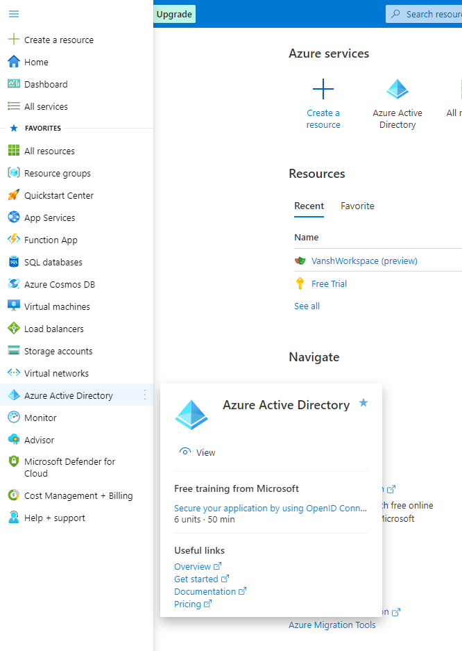
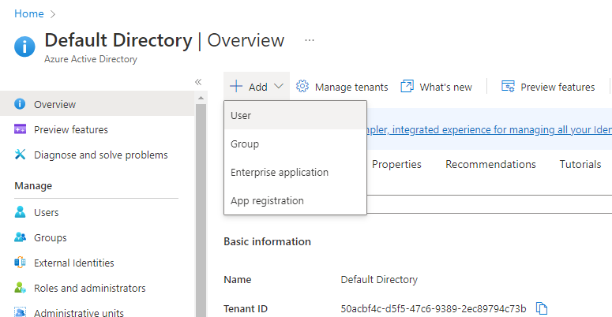
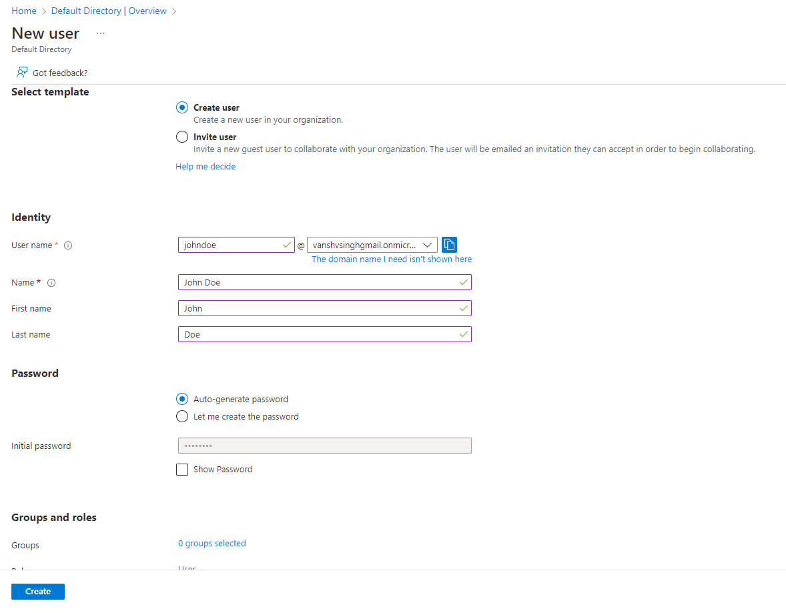
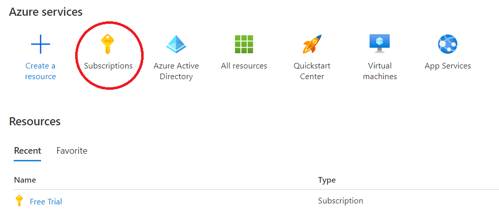

## Create a new Active Directory user for Playwright Service

1. Sign-in into the [Azure Portal](https://portal.azure.com) using your personal or Microsoft account and navigate to Azure Active Directory from the Portal menu.

    

3. Select the option to add new user

    

3. Select the template to create a new user and fill in the required fields. Make sure the username ends with onmicrosoft.com.
    You can choose to auto-generate a password or create your own password.
    

6. Open the list of subscriptions in your account and go to the subscription onboarded to Playwright Service.
    

7. Add role assignment for the user created in step#3. You can follow the instructions to add a role assignment [here](https://learn.microsoft.com/en-us/azure/role-based-access-control/role-assignments-portal-subscription-admin)

    NOTE: To enable this user to create a workspace, assign owner/contributor role  

7. You can now sign-in to [Playwright portal](https://aka.ms/mpt/portal) using the user credentials you created in step#3