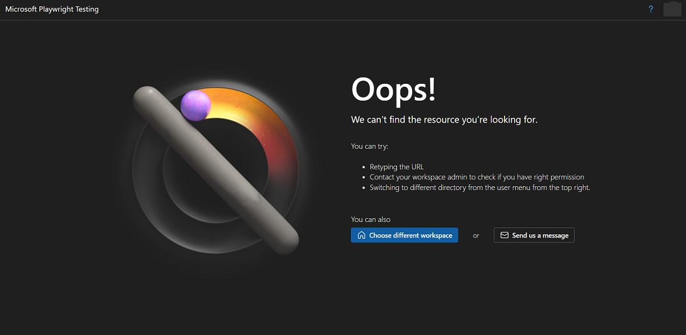

# Known Issues

## SSL peer certificate or SSH remote key was not OK
This error occurs when running WebKit on Windows, and is a known Playwright issue ([#24512](https://github.com/microsoft/playwright/issues/24512)).

**Workaround**: 
We recommend running WebKit on Linux for better fidelity and performance. To run your tests on Linux browsers, set the `PLAYWRIGHT_SERVICE_OS` environment variable:
```bash
PLAYWRIGHT_SERVICE_OS=linux
```

## Error signing into MPT Portal with a private browser tab
**[Microsoft Internal Only]** Signing into the MPT portal with your Microsoft corporate account (microsoft.com domain) is not supported in a private browser tab. This is because of the sign-in policy applied to these accounts. 

**Workaround:**
Sign into the MPT portal with a regular browser tab.

## Oops! We can't find the resource you are looking for

In the Playwright portal, when a user's session expires due to inactivity, a generic "Oops" error message appears. This message does not offer precise instructions or helpful guidance for the user to resolve the situation.

**Workaround**
Simply log out of the Playwright portal and log back in.