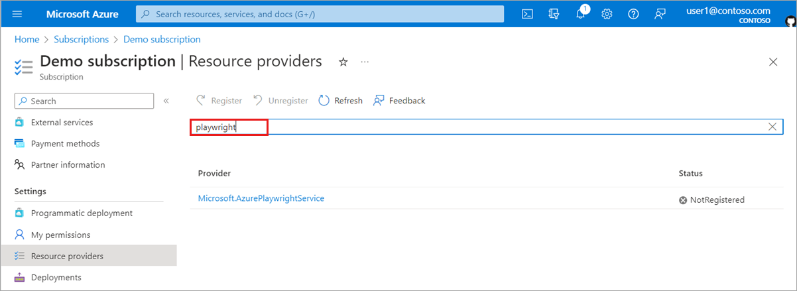
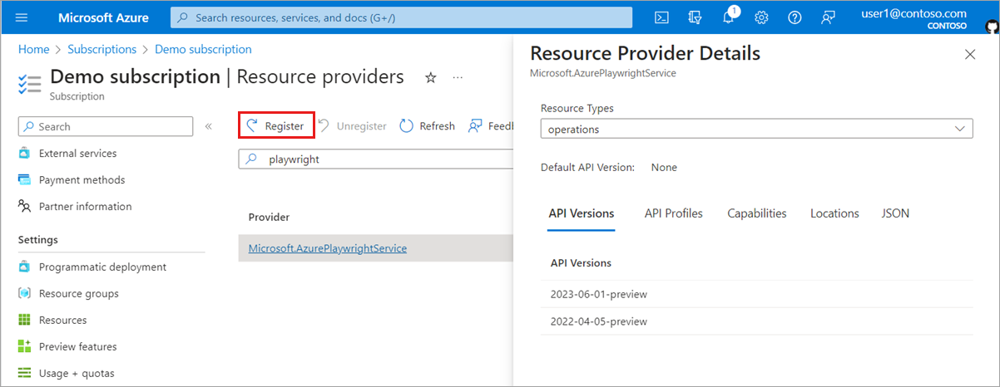

# Onboard your Azure subscription

While we are in preview, you'll need to perform a few one-off steps to gain access to the service. We're still building the service and we understand that the process might still be a bit rough around the edges, or that some of the steps may be unfamiliar. Don't worry, we're here to assist you every step of the way. Feel free to reach out to us if you encounter any challenges or have any questions.

Before you can get started with the Microsoft Playwright Testing preview, you need to perform the following steps:

1. Send us an email with your Azure subscription ID, so that we can allow-list your subscription.
1. Enable the Microsoft Playwright Testing resource provider in your subscription.

## Request access by email

1. Skip this step if you have already received an email confirming that your subscription has been allow-listed.
1. Otherwise, send an email to the product team at [playwrighttesting@microsoft.com](mailto:playwrighttesting@microsoft.com?subject=Microsoft%20Playwright%20Testing%20preview%20access%20request&body=Subscriptionid=<insert%20your%20subscription%20id>). Include your Azure subscription ID and use the subject line: "Microsoft Playwright Testing preview access request". Once you have done this, you will receive a confirmation email within 1-2 business days when your subscription is successfully onboarded. 

## Register Microsoft Playwright Testing resource provider for your subscription

Before you proceed:

- Verify that you have received an email confirmation that you have access to the service.

- Make sure you have the **Owner**, **Contributor** or **Service Administrator** role on the subscription. You can learn how to [check your role](https://learn.microsoft.com/en-us/azure/role-based-access-control/check-access) and how to [grant permissions](https://learn.microsoft.com/en-us/azure/role-based-access-control/quickstart-assign-role-user-portal).

Perform the following steps to register the Microsoft Playwright Testing resource provider:

1. Sign in to the [Azure portal](https://portal.azure.com) and select **Subscriptions**.  

    

1. Select the subscription that was onboarded for Microsoft Playwright Testing (the one you provided when requesting access).

    

1. Under **Settings**, select **Resource providers**.

    

1. In the **Resource providers** section, use the search bar to find *Microsoft.AzurePlaywrightService*.

    

1. Select **Microsoft.AzurePlaywrightService** from the provider list, and then select **Register**.

    > [!NOTE]
    > If your window is too small to display the **Register** button, close the "Resource Provider Details" pane to reveal it.

    

    If you're getting the following error, your account doesn't have the required permissions in the Azure subscription.

    

1. After completing the registration process, the status of the **Microsoft.AzurePlaywrightService** resource provider will change to **Registered**. Please note that it may take a few minutes for this change to be reflected.

    

### Congratulations! Your subscription is now onboarded for Microsoft Playwright Testing. You can proceed to the [Quickstart guide](./quickstart.md) to begin using the service.
