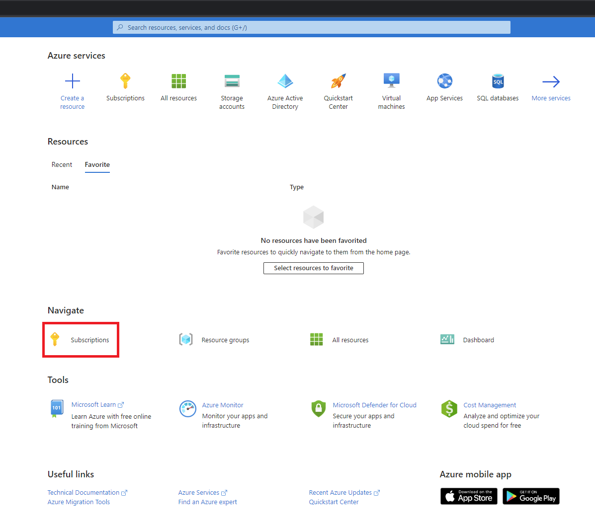

# Quickstart for Microsoft Playwright Testing Preview

In this quickstart, you'll learn how to run your existing tests with highly parallel cloud browsers using Microsoft Playwright Testing Preview.

If you prefer, you can run the [Get Started sample](../samples/get-started/) that has its own sample tests.

> [!IMPORTANT]
> Before you get started, make sure you have onboarded your Azure subscription. Follow these steps to [enable your Azure subscription for Microsoft Playwright Testing](./onboard-subscription.md).

# Prerequisites

- An Azure account with an active subscription. ([Create an account for free](https://azure.microsoft.com/free/).)
- [Onboard your Azure subscription to Microsoft Playwright Testing Preview](./onboard-subscription.md).

# Create a Workspace

##  Make sure your subscription is active

1. Sign in to the [Azure portal](https://portal.azure.com) and select **Subscriptions**.

    

1. Verify that the subscription state is *Active*.

    Subscriptions might be deactivated if the free trial is expired. You need to [reactivate the subscription](https://learn.microsoft.com/azure/cost-management-billing/manage/subscription-disabled) and select a plan.

     Note that Microsoft Playwright Testing is free while the service is in private preview. You won't incur any charges if you use your subscription only for Microsoft Playwright Testing.

## Create workspace from Playwright Portal

1. Sign in to the [Playwright portal](https://17157345.playwright-int.io/) using your Azure account credentials. (You may want to bookmark the website.)

1. If you see the **Create New Workspace** screen, provide the following information. If you don't see this screen, select an existing workspace and go to the next section.

    |Field  |Description  |
    |---------|---------|
    |**Workspace Name**     | A unique name to identify your workspace.<BR>The name can't contain special characters, such as \\/""[]:\|<>+=;,?*@&, or whitespace. |
    |**Azure Subscription**     | Select an Azure subscription. If you don't see anything in the drop-down, you need to [onboard an Azure subscription to the private preview](./onboard-subscription.md). |
    |**Location**     | Select a geographic location to host your workspace. <BR>This is the location of service-managed browsers that your tests connect to. Currently, only _East US_ is supported |

1. Select **Create Workspace**.

    

# Configure your project to run tests with Microsoft Playwright Testing

Once you've successfully created a workspace, follow these steps to configure and run Playwright tests at scale.

## Prepare your test suite to run on Microsoft Playwright Testing

Microsoft Playwright Test (MPT) browsers run in the cloud and not inside your local network, so some test execution slowdown can be expected. The advantage of MPT is that you can make up for this difference by scaling out the number of tests you run at the same time. If you see individual tests taking much longer to run remotely as they do locally, there are several things you can do that to improve your performance:

* Use a closer region to reduce latency. Currently, MPT browsers only run in EastUS so your options may be somewhat limited, but more regions are coming soon.
* Turn off tracing, screenshots, and video when you're not using them. Typically, these artifacts are only useful on failures, so `on-first-retry` and `retain-on-failure` can be more efficient options. 
* Increase the `timeout` property in your `playwright.service.config.ts` file to account for the additional latency that will be incurred.


## Add Microsoft Playwright Testing configuration
    
Add the following files to your project in the same location as your current Playwright config file.
        
1. [playwright-service.ts](https://github.com/microsoft/playwright-service-preview/blob/main/samples/get-started/playwright-service.ts): This file enables Playwright client to connect to remote browsers to execute tests.

2. [playwright.service.config.ts](https://github.com/microsoft/playwright-service-preview/blob/main/samples/get-started/playwright.service.config.ts): This file adds service-related configuration to your project, for example the target operating system.
        


NOTE: Make sure your project uses @playwright/test 1.32 or above. 

## Create an Access Key
   
1. In the [Playwright portal](https://17157345.playwright-int.io/), select **Generate key** to create the access key. 

1. In a Terminal window, set the access key as an environment variable. 

NOTE: Copy this key now as you will not be able to see the same key again.


    

## Run tests with Microsoft Playwright Testing

Run Playwright tests against browsers managed by the service using the configuration you created above.

    npx playwright test --config=playwright.service.config.ts --workers=20

## Optimize parallel worker configuration

Once your tests are running smoothly with the service, experiment with varying the number of parallel workers to determine the optimal configuration that minimizes test completion time. With Microsoft Playwright Testing, you can run with up to 50 parallel workers, but several factors come into play that will determine to best configuration for your project, such as the CPU, memory, and network resources of your client machine, the target application's load-handling capacity, and the type of actions carried out in your tests.

# Troubleshooting
If you're having trouble running your tests on the service, take a look at our [troubleshooting guide](./troubleshooting.md) for help. If you are still stuck or have any questions, feel free to [open an issue](https://github.com/microsoft/playwright-service-preview/issues) and engage with the product team.
    
# Next Steps
* Experiment with different levels of parallelism (at this time, you can run up to 50 parallel workers). Test performance can be affected by multiple factors, including your target application's response times under load, network latency between the browsers and target application, and the test scenario itself. [Learn more about how parallelism works with Playwright.](./concept-understanding-parallelism.md)

    ```bash
    npx playwright test --config=playwright.service.config.ts --workers=50
    ```

* [Run tests in a CI/CD pipeline.](./configure-tests-with-ci-cd-pipeline.md)

* [Learn how to manage access to Microsoft Playwright Testing workspace.](./how-to-assign-roles.md)
 
