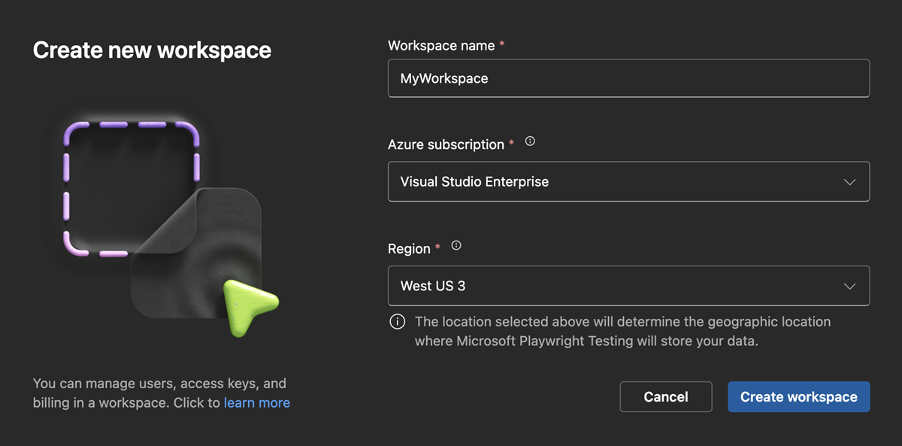

# Quickstart for Microsoft Playwright Testing Preview

In this quickstart, you'll learn how to run your existing tests with highly parallel cloud browsers using Microsoft Playwright Testing Preview.

## Confirm access to the private preview (this is a temporary step)

While we're in private preview, you'll need to perform a few one-off steps in this guide: [Enable your Azure subscription for Microsoft Playwright Testing](./onboard-subscription.md)

We're still building the service and we understand that the process might still be a bit rough around the edges, or that some of the steps may be unfamiliar. Feel free to[ reach out to us](https://aka.ms/mpt/feedback) if you encounter any challenges or have any questions.

## Create a Workspace

1. Sign in to the [Playwright portal](https://aka.ms/mpt/portal) using your Azure account credentials. (You may want to bookmark the website.)

1. If you see the **Create New Workspace** screen, provide the following information. If you don't see this screen, select an existing workspace and go to the next section.

    |Field  |Description  |
    |---------|---------|
    |**Workspace Name**     | A unique name to identify your workspace.<BR>The name can't contain special characters, such as \\/""[]:\|<>+=;,?*@&, or whitespace. |
    |**Azure Subscription**     | Select an Azure subscription. If you don't see anything in the drop-down, you need to [onboard an Azure subscription to the private preview](./onboard-subscription.md). |
    |**Region**     | This is where test run data will be stored for your workspace. |

1. Select **Create Workspace**.

    

## Prepare your test suite to run on Microsoft Playwright Testing

Microsoft Playwright Test (MPT) browsers run in the cloud and not inside your local network, so some test execution slowdown can be expected. The advantage of MPT is that you can make up for this difference by scaling out the number of tests you run at the same time. If you see individual tests taking much longer to run remotely as they do locally, there are several things you can do that to improve your performance:

* Use a closer region to reduce latency. Currently, MPT browsers run in East US, West US, West Europe, and East Asia.
* Turn off tracing, screenshots, and video when you're not using them. Typically, these artifacts are only useful on failures, so `on-first-retry` and `retain-on-failure` can be more efficient options.
* Increase the `timeout` property in your `playwright.service.config.ts` file to account for the additional latency that will be incurred.


## Add Microsoft Playwright Testing configuration

Add the service config to your project in the same location as your current Playwright config file. Use [playwright.service.config.ts](https://aka.ms/mpt/service-config) as a starting point.

Service config is used to:
- Point Playwright at Microsoft Playwright Testing server.
- Override timeouts for service operations if necessary.

NOTE: Make sure your project uses @playwright/test 1.37 or above.

## Create an Access Key

1. In the [Playwright portal](https://aka.ms/mpt/portal), select **Generate key** to create the access key.

1. In a Terminal window, set the access key as an environment variable.

NOTE: Copy this key now as you will not be able to see the same key again.


## Add region endpoint in your set up
 
 1. In the [Playwright portal](https://aka.ms/mpt/portal), copy the command under **Add region endpoint in your set up** and run in your terminal.

 NOTE: The endpoint URL corresponds with the workspace region. You might see a different endpoint URL in the Playwright portal, depending on the region you selected when creating the workspace. 
 
 

## Run tests with Microsoft Playwright Testing

Run Playwright tests against browsers managed by the service using the configuration you created above.

    npx playwright test --config=playwright.service.config.ts --workers=20

## Optimize parallel worker configuration

Once your tests are running smoothly with the service, experiment with varying the number of parallel workers to determine the optimal configuration that minimizes test completion time. With Microsoft Playwright Testing, you can run with up to 50 parallel workers, but several factors come into play that will determine the best configuration for your project, such as the CPU, memory, and network resources of your client machine, the target application's load-handling capacity, and the type of actions carried out in your tests.

# Troubleshooting & Known Issues
If you're having trouble running your tests on the service, take a look at our [troubleshooting guide](./troubleshooting.md) and [known issues](./known-issues.md) for help. If you are still stuck or have any questions, feel free to [open an issue](https://aka.ms/mpt/feedback) and engage with the product team.

# Next Steps
* Experiment with different levels of parallelism (at this time, you can run up to 50 parallel workers). Test performance can be affected by multiple factors, including your target application's response times under load, network latency between the browsers and target application, and the test scenario itself. [Learn more about how parallelism works with Playwright.](./concept-understanding-parallelism.md)

    ```bash
    npx playwright test --config=playwright.service.config.ts --workers=50
    ```

* [Run tests in a CI/CD pipeline.](./configure-tests-with-ci-cd-pipeline.md)

* [Learn how to manage access to Microsoft Playwright Testing workspace.](./how-to-assign-roles.md)

* [Known issues about Microsoft Playwright Testing](./known-issues.md)
 

